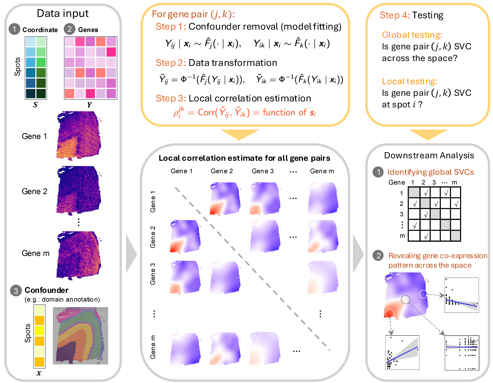

# spCorr

**spCorr** models spatially variable gene co-expression patterns in spatial transcriptomics.


## Overview



## Installation<a name="installation-"></a>

To install the development version from GitHub, please run:

```r
if (!require("devtools", quietly = TRUE))
    install.packages("devtools")
devtools::install_github("chexjiang/spCorr")
```

## Quick Start<a name="quick-start"></a>

The following code is a quick example of running spCorr. The function `spCorr()` takes in `count_mat`, `gene_list`, `gene_pair_list`, and `cov_mat` (which should include spatial coordinates and any confounders).


``` r
spCorr <- function(count_mat,
                   gene_list,
                   gene_pair_list,
                   cov_mat,
                   formula1 = "1",
                   family1 = "nb",
                   formula2 = "s(x1, x2, bs='tp', k=50)",
                   family2 = quasiproductr(),
                   DT = TRUE,
                   global_test = "wald",
                   return_models = FALSE,
                   return_coefs = FALSE,
                   check_morani = FALSE,
                   preconstruct_smoother = TRUE,
                   ncores = 2,
                   control = list(),
                   epsilon = 1e-6,
                   seed = 123)
```

The parameters of `spCorr()` are:

- `count_mat`: A matrix of counts where rows represent genes and columns represent observations.

- `gene_list`: A list of gene names for which the conditional margins are to be fit.

- `gene_pair_list`: A data frame or matrix containing pairs of gene names (or indices) to be analyzed.

- `cov_mat`: A matrix of covariates, including spatial coordinates and any confounders.

- `formula1`: A formula specifying the model to be used for fitting the marginal distributions.  
    - If no confounder needs to be removed, set `formula1 = "1"`.  
    - If confounders need to be removed, specify `formula1 = "confounder_name"`, where `confounder_name` is the column name from `cov_mat` representing the confounder.

- `family1`: The distribution family for marginals (e.g., `'gaussian'`, `'poisson'`, `'nb'`).  

- `formula2`: A formula specifying the model for fitting the product distributions.  
    - *Examples*: `"s(x1, x2, bs='tp', k=50)"`, `"s(x1, x2, bs='gp', k=50)"`.

- `family2`:  The distribution family for the product model.  Default is `quasiproductr()`.

- `DT`: Logical; if `TRUE`, applies a discrete transformation suitable for count data. Default is `TRUE`.

- `global_test`: Method for global testing in product models. Options: `"lrt"` (likelihood ratio test) or `"wald"` (Wald-style smooth term test). Default is `"wald"`.

- `return_models`: Logical; if `TRUE`, return full GAM model objects. Default is `FALSE`.

- `return_coefs` Logical; if `TRUE`, return model coefficients and covariance matrices. Default is `FALSE`.

- `check_morani`: Logical; if `TRUE`, filters gene pairs using Moran's I on the product. Default is `FALSE`.

- `preconstruct_smoother`: Logical; if `TRUE`, replaces `bs='tp'`/`'gp'` with `tpcached`/`gpcached` for faster computation. Default is `TRUE`.

- `ncores`: Integer number of cores for parallel processing. Default is `2`.

- `control`: A list of control parameters passed to `mgcv::gam()` during product fitting.

- `epsilon`: A small constant to avoid boundary issues in the uniform-to-Gaussian transformation. Default is `1e-6`.

- `seed`: A seed for reproducibility. Default is `123`.

