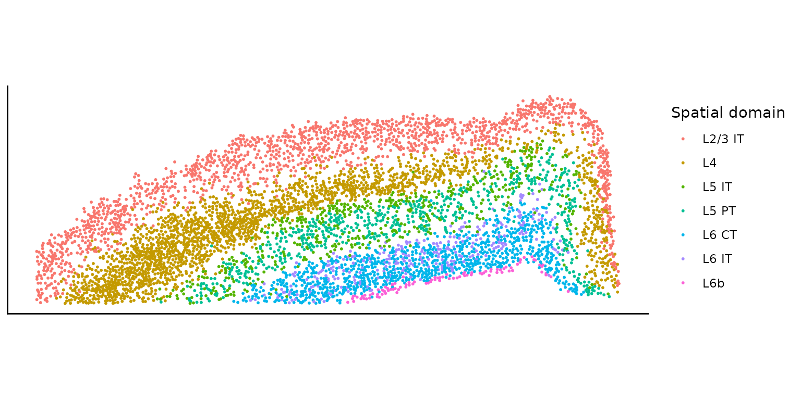
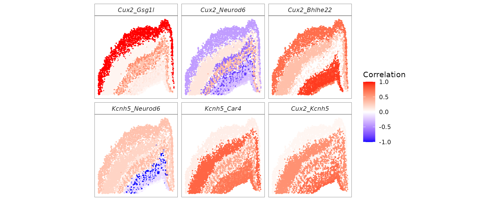

# Modeling spatially varying gene correlation across spatial domains

``` r
library(spCorr)
library(Seurat)
library(purrr)
library(tibble)
library(ggplot2)
library(dplyr)
library(tidyr)
library(viridis)
library(MorphoGAM)
library(stats)
library(utils)
```

## Introduction

This tutorial demonstrates how to use **spCorr** to (i) infer spot-level
gene–gene correlations for specified gene pairs, and (ii) identify gene
pairs exhibiting *spatially varying correlation (SVC)* patterns across
spatial domains.

## Prepare input data

In this example, we analyze a subset of the **mouse brain cortex**
dataset generated using the **10x Xenium** platform. The dataset is
provided by 10x Genomics as part of the “Fresh Frozen Mouse Brain for
Xenium Explorer Demo,” available at [10x
Genomics](https://www.10xgenomics.com/datasets/fresh-frozen-mouse-brain-for-xenium-explorer-demo-1-standard).

``` r
## Load example ST data
# It contains a Seurat object
tf <- tempfile(fileext = ".rds")
utils::download.file("https://ndownloader.figshare.com/files/66021356", tf, mode = "wb")
xenium.obj <- readRDS(tf)
unlink(tf)

xenium.obj <- UpdateSeuratObject(xenium.obj)
xenium.obj$ccf_region <- gsub("1|2/3|4|5|6a|6b", "", xenium.obj$ccf) %>%
  as.factor() %>%
  droplevels()

# Subset celltypes
celltypes <- c("L2/3 IT", "L4", "L5 IT", "L5 PT", "L6 CT", "L6 IT", "L6b")
xenium_sub.obj <- xenium.obj[, xenium.obj$ensembled.celltype1 %in% celltypes]
```

Now we prepare the input data for **spCorr** analysis.

``` r
# Count matrix
count_mat <- xenium_sub.obj[["Xenium"]]$counts
# Covariate matrix
cov_mat <- cbind(GetTissueCoordinates(xenium_sub.obj), xenium_sub.obj@meta.data)
rownames(cov_mat) <- colnames(count_mat)
```

We extract the spatial domain information from the covariate matrix. The
spatial domain information is based on the CCF region annotations
provided in the Seurat object.

``` r
plot_domain <- ggplot(cov_mat, aes(x = x, y = y, color = ensembled.celltype1)) +
  geom_point(size = 0.4) +
  labs(color = "Spatial domain") +
  coord_fixed() +
  scale_y_reverse() +
  theme_classic() +
  theme(
    axis.title = element_blank(),
    axis.text = element_blank(),
    axis.ticks = element_blank()
  )
plot_domain
```



In this tutorial, we will focus on a subset of 10 genes that are highly
expressed in the L2/3 IT cell type. We will analyze all possible gene
pairs among these 10 genes.

``` r
gene_list <- c("Cux2", "Kcnh5", "Car4", "Rims3", "Bhlhe22", "Neurod6", "Gsg1l", "Cpne8", "Dpy19l1", "Cdh6")
gene_pair_list <- t(combn(gene_list, 2))
rownames(gene_pair_list) <- apply(gene_pair_list, 1, paste0, collapse = "_")
```

## Run spCorr

We now apply **spCorr** to infer spot-level gene–gene correlations for
the selected gene pairs and to identify gene pairs with spatially
varying correlation (SVC) pattern across the spatial domains (associated
with the cell types `ensembled.celltype1`).

``` r
res <- spCorr(count_mat,
  gene_list,
  gene_pair_list,
  cov_mat,
  formula1 = "1",
  formula2 = "ensembled.celltype1",
  return_pi = TRUE,
  ncores = 5,
  seed = 123
)
#> Start Marginal Fitting for 10 genes
#> Start Cross-Product Fitting for 45 gene pairs
```

## Visualize spot-level correlations

We next visualize the inferred spot-level correlations and SVC patterns
for specific gene pairs.

``` r
# Use the top gene pairs with the smallest FDR values for visualization
top_pairs <- names(sort(res$fdr))[1:6]

# Assemble spot-level correlation estimates and their confidence intervals
rho_df_long <- purrr::map_dfr(top_pairs, function(gp) {
  tibble::tibble(
    x = cov_mat$x, y = cov_mat$y, gene_pair = gp,
    rho = as.numeric(res$res_local[gp, ])
  )
}) %>%
  dplyr::mutate(gene_pair = factor(gene_pair, levels = top_pairs))

# Visualize the estimated spot-level correlations across 2D space
p_corr_d <- ggplot(rho_df_long, aes(x = x, y = y, color = rho)) +
  geom_point(size = 0.3) +
  facet_wrap(~gene_pair, nrow = 2) +
  coord_fixed() +
  scale_y_reverse() +
  scale_color_gradient2(low = "blue", mid = "white", high = "red", midpoint = 0, limits = c(-1, 1), name = "Correlation") +
  theme_minimal() +
  theme(
    aspect.ratio = 1,
    legend.position = "right",
    axis.title = element_blank(),
    axis.text = element_blank(),
    axis.ticks = element_blank(),
    panel.grid = element_blank(),
    panel.border = element_rect(color = "black", fill = NA, linewidth = 0.2),
    strip.background = element_rect(color = "black", fill = NA, linewidth = 0.2),
    strip.text.x = element_text(face = "italic")
  )

p_corr_d
```



## Session information

``` r
sessionInfo()
#> R version 4.2.3 (2023-03-15)
#> Platform: x86_64-pc-linux-gnu (64-bit)
#> Running under: Ubuntu 22.04.5 LTS
#> 
#> Matrix products: default
#> BLAS:   /usr/lib/x86_64-linux-gnu/openblas-pthread/libblas.so.3
#> LAPACK: /usr/lib/x86_64-linux-gnu/openblas-pthread/libopenblasp-r0.3.20.so
#> 
#> locale:
#>  [1] LC_CTYPE=en_US.UTF-8       LC_NUMERIC=C              
#>  [3] LC_TIME=en_US.UTF-8        LC_COLLATE=en_US.UTF-8    
#>  [5] LC_MONETARY=en_US.UTF-8    LC_MESSAGES=en_US.UTF-8   
#>  [7] LC_PAPER=en_US.UTF-8       LC_NAME=C                 
#>  [9] LC_ADDRESS=C               LC_TELEPHONE=C            
#> [11] LC_MEASUREMENT=en_US.UTF-8 LC_IDENTIFICATION=C       
#> 
#> attached base packages:
#> [1] stats     graphics  grDevices utils     datasets  methods   base     
#> 
#> other attached packages:
#>  [1] MorphoGAM_1.0.0    viridis_0.6.5      viridisLite_0.4.2  tidyr_1.3.2       
#>  [5] dplyr_1.1.4        ggplot2_4.0.1      tibble_3.3.1       purrr_1.2.1       
#>  [9] Seurat_5.4.0       SeuratObject_5.3.0 sp_2.2-0           spCorr_1.0.0.0000 
#> [13] BiocStyle_2.26.0  
#> 
#> loaded via a namespace (and not attached):
#>   [1] spatstat.univar_3.1-6  spam_2.11-3            systemfonts_1.3.1     
#>   [4] plyr_1.8.9             igraph_2.2.1           lazyeval_0.2.2        
#>   [7] nanonext_1.7.2         splines_4.2.3          RcppHNSW_0.6.0        
#>  [10] listenv_0.10.0         scattermore_1.2        digest_0.6.39         
#>  [13] gratia_0.11.1          invgamma_1.2           htmltools_0.5.9       
#>  [16] SQUAREM_2021.1         magrittr_2.0.4         tensor_1.5.1          
#>  [19] cluster_2.1.6          ROCR_1.0-12            globals_0.19.1        
#>  [22] dimRed_0.2.7           matrixStats_1.5.0      pkgdown_2.2.0         
#>  [25] spatstat.sparse_3.1-0  princurve_2.1.6        ggrepel_0.9.6         
#>  [28] textshaping_1.0.4      xfun_0.56              jsonlite_2.0.0        
#>  [31] progressr_0.18.0       spatstat.data_3.1-9    survival_3.7-0        
#>  [34] zoo_1.8-15             ape_5.8-1              glue_1.8.1            
#>  [37] DRR_0.0.4              polyclip_1.10-7        gtable_0.3.6          
#>  [40] kernlab_0.9-33         future.apply_1.20.1    abind_1.4-8           
#>  [43] scales_1.4.0           spatstat.random_3.4-4  miniUI_0.1.2          
#>  [46] Rcpp_1.1.1             xtable_1.8-4           reticulate_1.44.1     
#>  [49] dotCall64_1.2          tweedie_2.3.5          truncnorm_1.0-9       
#>  [52] htmlwidgets_1.6.4      httr_1.4.7             RColorBrewer_1.1-3    
#>  [55] ica_1.0-3              pkgconfig_2.0.3        farver_2.1.2          
#>  [58] sass_0.4.10            uwot_0.2.4             deldir_2.0-4          
#>  [61] labeling_0.4.3         tidyselect_1.2.1       rlang_1.1.7           
#>  [64] reshape2_1.4.5         later_1.4.5            tools_4.2.3           
#>  [67] cachem_1.1.0           mirai_2.5.3            cli_3.6.6             
#>  [70] generics_0.1.4         ggridges_0.5.7         evaluate_1.0.5        
#>  [73] stringr_1.6.0          fastmap_1.2.0          yaml_2.3.12           
#>  [76] ragg_1.5.0             goftest_1.2-3          knitr_1.51            
#>  [79] fs_2.1.0               fitdistrplus_1.2-6     RANN_2.6.2            
#>  [82] pbapply_1.7-4          future_1.69.0          nlme_3.1-164          
#>  [85] mime_0.13              mvnfast_0.2.8          compiler_4.2.3        
#>  [88] rstudioapi_0.18.0      ggokabeito_0.1.0       plotly_4.12.0         
#>  [91] png_0.1-8              spatstat.utils_3.2-1   bslib_0.10.0          
#>  [94] stringi_1.8.7          desc_1.4.3             RSpectra_0.16-2       
#>  [97] lattice_0.22-6         Matrix_1.6-5           vctrs_0.7.1           
#> [100] pillar_1.11.1          lifecycle_1.0.5        BiocManager_1.30.27   
#> [103] spatstat.geom_3.7-0    lmtest_0.9-40          jquerylib_0.1.4       
#> [106] RcppAnnoy_0.0.23       data.table_1.18.4      cowplot_1.2.0         
#> [109] irlba_2.3.7            httpuv_1.6.16          patchwork_1.3.2       
#> [112] R6_2.6.1               bookdown_0.46          promises_1.5.0        
#> [115] KernSmooth_2.23-24     gridExtra_2.3          parallelly_1.46.1     
#> [118] codetools_0.2-20       dichromat_2.0-0.1      gtools_3.9.5          
#> [121] fastDummies_1.7.5      MASS_7.3-58.2          CVST_0.2-3            
#> [124] withr_3.0.2            sctransform_0.4.3      mgcv_1.9-3            
#> [127] parallel_4.2.3         grid_4.2.3             rmarkdown_2.30        
#> [130] ashr_2.2-63            S7_0.2.1               otel_0.2.0            
#> [133] Rtsne_0.17             mixsqp_0.3-54          spatstat.explore_3.7-0
#> [136] shiny_1.12.1
```
